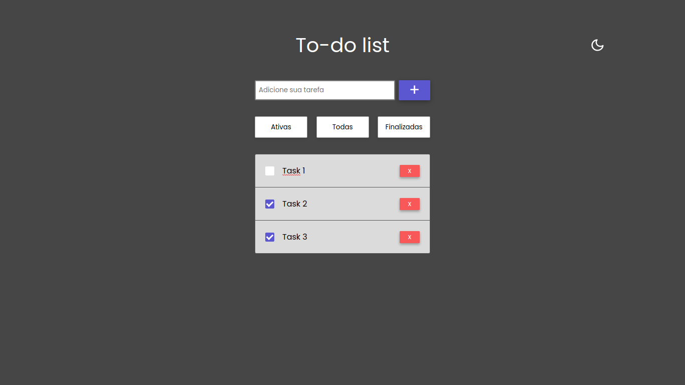
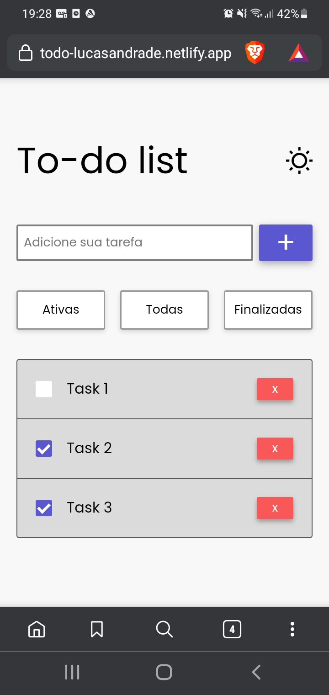

# 📝 To Do App


> Um projeto clássico de lista de tarefas para você se organizar melhor, basta inserir a tarefa que desejar um marcar como concluída quando finaliza-la.

## 🖥️ Dekstop



## 📱 Mobile



## 🛠️ Techs


## ⚙️ Ajustes e melhorias

O projeto ainda está em desenvolvimento e as próximas atualizações serão voltadas nas seguintes tarefas:

- [x]  O usuário poderá informar a tarefa em um campo de `input`
- [x]  O usuário poderá enviar a tarefa para lista clicando no botão de adicionar
- [x]  O usuário poderá marcar a tarefa como concluída clicando no `checkbox`
- [x]  Ao marcar marcar como concluído a tarefa sumirá
- [x]  O usuário poderá deletar a tarefa da lista clicando no botão de deletar
- [x]  As tarefas ficarão salvas no `localStorage` do navegador
- [x]  O usuário não poderá adicionar uma tarefa com o campo de `input` vazio
- [x]  O usuário poderá ver as tarefas concluídas e ativas
- [x]  O usuário poderá ver as todas tarefas
- [x]  O usuário poderá editar uma tarefa clicando no texto da tarefa
- [x]  Dark mode

## 🛸 Instalação e Execução do projeto

Para clonar este repositório utilize o comando:

```bash
git clone https://github.com/LucasAndrade912/to-do-app.git
```

Instale as dependências do projeto:

```bash
npm install

# or

yarn install
```

Para executar o projeto utilize o comando:

```bash
npm start

# or

yarn start
```

Após isto, seu navegador será aberto após a inicialização do servidor de desenvolvimento.
